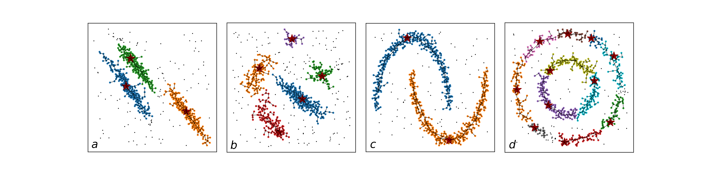
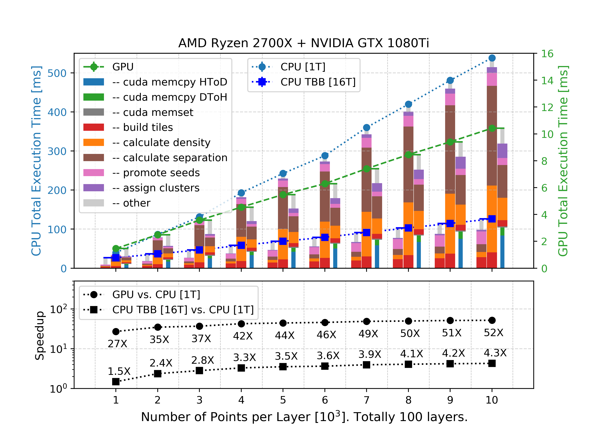

# Standalone CLUE Algorithm on GPU and CPU

Z.Chen[1], A. Di Pilato[2,3], F. Pantaleo[4], M. Rovere[4], C. Seez[5]

*[1] Northwestern University, [2]University of Bari, [3]INFN, [4] CERN, [5]Imperial College London*

## 1. Setup

The pre-requisite dependencies are `>=gcc7`, `<=gcc8.3`, `>=cuda10`, `Boost`, `TBB`. Fork this repo if developers.

* **On an Ubuntu machine with GPUs:** Install Boost and TBB first.
```bash
sudo apt-get install libtbb-dev
sudo apt-get install libboost-all-dev

# then setup this project
git clone --recurse-submodules https://gitlab.cern.ch/kalos/clue.git
```

### 2. Run CLUE
CLUE needs three parameters: `dc`, `rhoc` and `outlierDeltaFactor`

_dc_ is the critical distance used to compute the local density.
_rhoc_ is the minimum local density for a point to be promoted as a Seed.
_outlierDeltaFactor_ is  a multiplicative constant to be applied to `dc`.

If the projects compiles without errors, you can go run the CLUE algorithm by
```bash
# ./main [fileName] [dc] [rhoc] [outlierDeltaFactor]
./main aniso_1000 20 25 2
```

The input files are `data/input/*.csv` with columns 
* x0, x1, ..., xn, weight

The output files are `data/output/*.csv` with columns
* x0, x1, ..., xn, weight, rho, delta, nh, isSeed, clusterId

If you encounter any error when compiling or running this project, please
contact us.

## 3. Examples
The clustering result of a few synthetic dataset is shown below


## 4. Performance on Toy Events
We generate toy events on toy detector consist of 100 layers.
The average execution time of toy events on CPU and GPU are shown below

